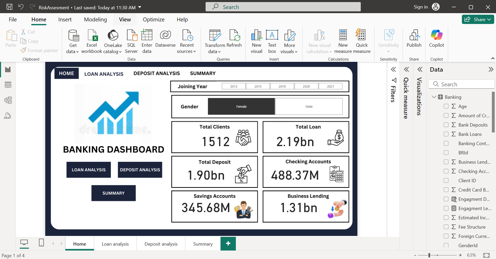
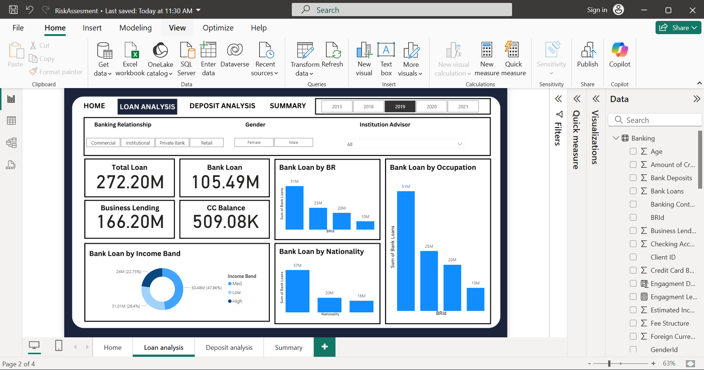
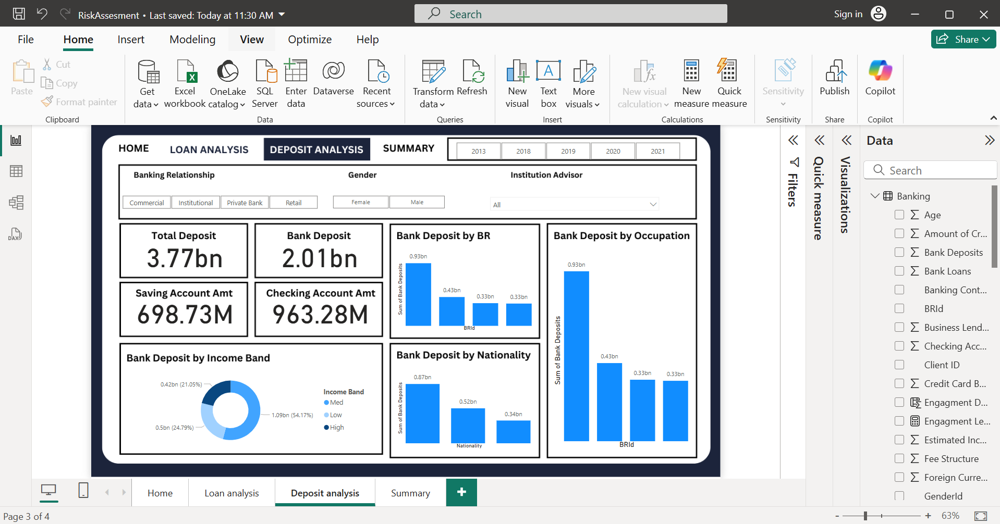
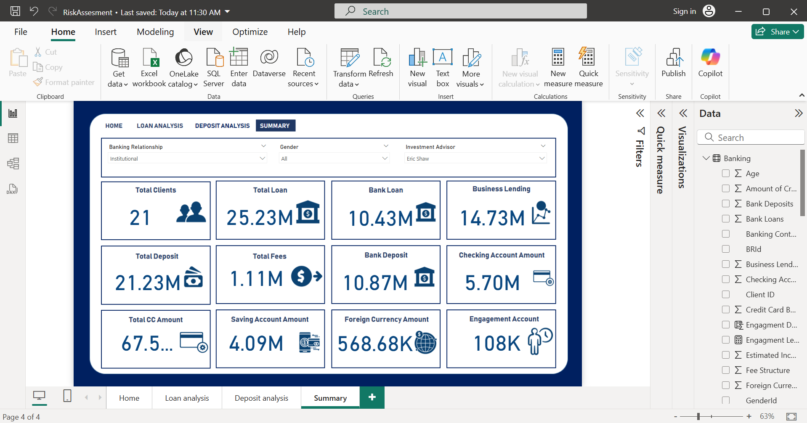

# Risk Assessment Analysis for Banking Sector

## Overview
This project analyzes banking customer data to identify financial behavior patterns, risk factors, and customer segmentation.  
It combines database connection, data preprocessing, Exploratory Data Analysis (EDA), and dashboard creation.

## Key Features
- Connected to a MySQL database and retrieved banking customer data.
- Performed data cleaning, preprocessing, and feature engineering with Python.
- Conducted univariate, bivariate, and multivariate analysis.
- Built an interactive PowerBI dashboard to visualize key metrics.

## Technologies Used
- Python (Pandas, Seaborn, Matplotlib, NumPy)
- MySQL
- PowerBI

# Dashboard

Here is the overview of the banking risk analysis dashboard:

## Banksing Dashboard

## Loan Analysis

## Deposit Analysis

## Summary

